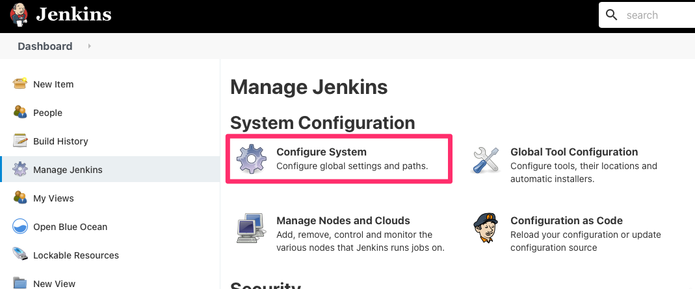
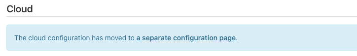
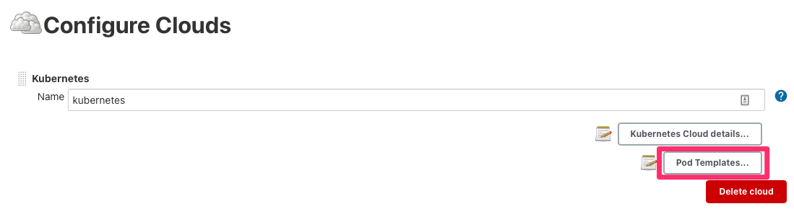
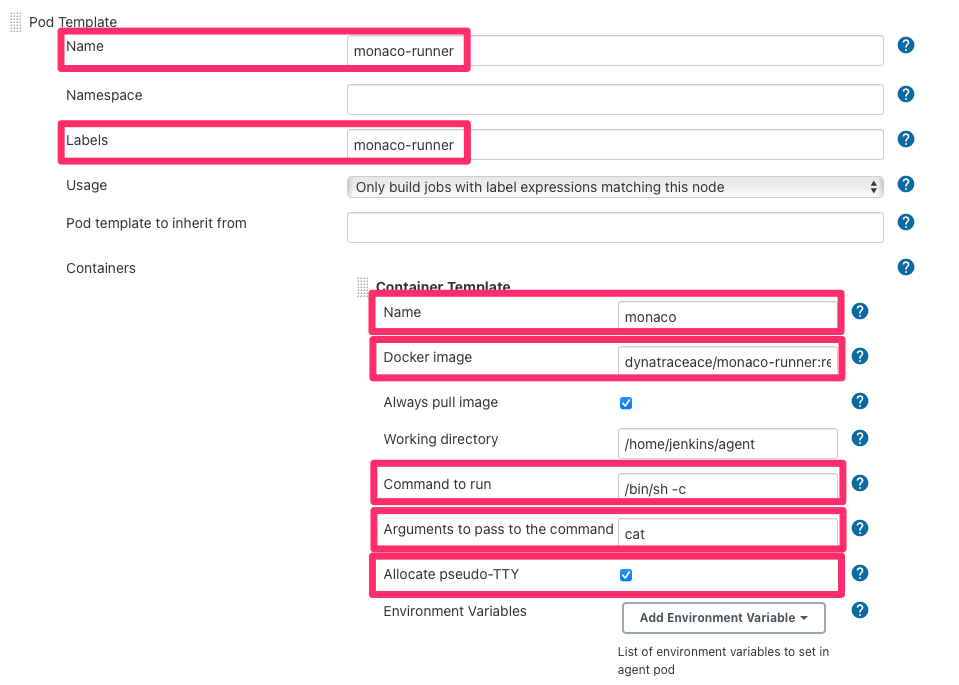

# monaco-runner
A container image that contains Dynatrace's Monaco (Monitoring as Code) toolset to be used within a CI/CD pipeline

Dynatrace Monaco (Monitoring as Code) v1.1.0 toolset available as `monaco` command. more info: https://github.com/dynatrace-oss/dynatrace-monitoring-as-code 

- [monaco-runner](#monaco-runner)
  - [Using the monaco-runner in a Jenkins environment with Kubernetes integration](#using-the-monaco-runner-in-a-jenkins-environment-with-kubernetes-integration)
  - [Dealing with untrusted certificates](#dealing-with-untrusted-certificates)

## Using the monaco-runner in a Jenkins environment with Kubernetes integration
1. Go to `Manage Jenkins` and click on `Configure System`


1. At the bottom of the page, click on the link directing you to cloud configuration


1. On the Cloud Configuration page, click on `Pod Templates...`


1. Add a new pod template and fill it in as follows:
   1. `Name`: A free name for you to give to the template
   2. `Labels`: A label we will use to refer to this template, `monaco-runner` will be used in a later pipeline
   3. `Container template name`: the name of this container, `monaco` will be used in a later pipeline
   4. `Docker Image`: `dynatraceace/monaco-runner:release-v1.1.0` *Note* a new release might be available
   5. `Command to run`: `/bin/sh -c`
   6. `Arguments to pass to the command`: `cat`
   7. `Allocate pseudo-TTY`: `yes`


2. Click on Save

1. In your `Jenkinsfile` you can now refer to the runner like this:
    ```
    pipeline {
        agent {
            label 'monaco-runner'
        }
        stages {
            stage('Dynatrace global config - Deploy') {
                steps {
                    container('monaco') {
                        script{
                            sh "monaco -v -e=$ENVS_FILE -p=global monaco/projects"
                        }
                    }
                }
            }   
        }
    }
    ```

## Dealing with untrusted certificates
In cases where you need to use Monaco against a Dynatrace environment with untrusted certificates, you can use this image as a base for creating a custom Docker image. An example for that is in [with_certs/Dockerfile](with_certs/Dockerfile)
```
FROM dynatraceace/monaco-runner:release-v1.1.0 
LABEL version="1.0" maintainer="Dynatrace ACE team<ace@dynatrace.com>"

RUN apk --no-cache add ca-certificates

ADD ca-certificates.crt /etc/ssl/certs/

ENTRYPOINT ["/bin/bash", "-l", "-c"]
```